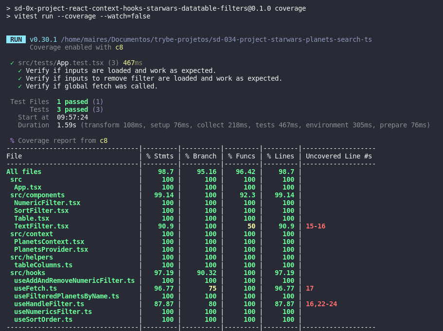

# <p align="center">Projeto Star Wars Planets Search</p>

## Contexto

Esse projeto consiste em uma lista de planetas do universo Star Wars, equipada com `filtros`. Para gerenciar os estados globais, são utilizados `Context API`, `Hooks` e `Custom Hooks`. Essas tecnologias permitem um controle eficiente dos estados, facilitando a implementação de filtros e proporcionando uma experiência de usuário mais dinâmica e interativa. Os testes foram escritos `vitest` e `react testing library`. Nessa aplicação é possível adicionar e remover os filtros além de poder ordenar a lista e fazer uma busca pelo nome.

<details>

<summary><strong>Rode o projeto localmente</strong></summary><br>

> ⚠️ É preciso ter o [Node](https://nodejs.org/en) instalado em sua máquina.

Clone o repositório:

```JSON
git clone git@github.com:mairess/project-starwars-planets-search.git
```

Instale as dependências:

```JSON
npm install
```

Inicie o vite server:

```JSON
npm run dev
```

### Os testes

Rode os testes com:

```JSON
npm test
```

Rode a cobertura dos testes:

```JSON
npm run coverage
```

</details>

<details>

<summary><strong>Rode o projeto com o docker</strong></summary><br>

> ⚠️ É preciso ter o [Docker](https://www.docker.com/get-started/) instalado em sua máquina.

Clone o repositório:

```JSON
git clone git@github.com:mairess/project-starwars-planets-search.git
```

Suba o container:

```JSON
docker compose up -d
```

O vite server estará disponível na porta `3000`:

```HTML
http://localhost:3000
```

</details>

### Cobertura



## Competências desenvolvidas

- Capacidade de utilizar `Context API` para gerenciar o estado.
- Capacidade de utilizar React Hook `useContext`.
- Capacidade de criar `custom hooks`.
- Capacidade para testar e garantir uma boa cobertura de testes.
- Capacidade de `testar` a aplicação.
